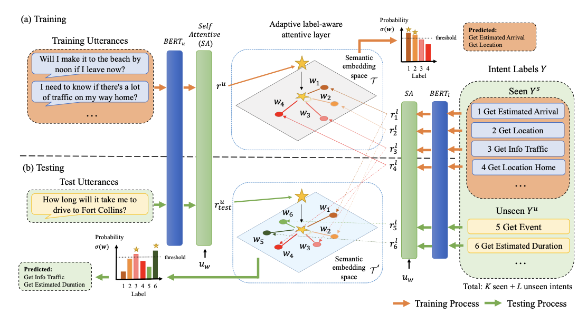

# LABAN (EMNLP 2021)

This repository contains the code and resources for the following paper: <br>
https://aclanthology.org/2021.emnlp-main.399/

```
Ting-Wei Wu, Ruolin Su and Biing-Hwang Juang, "A Label-Aware BERT Attention Network for Zero-Shot Multi-Intent Detection in Spoken Language Understanding". In EMNLP 2021 (Main Conference)
```

It was published in [EMNLP 2021](https://2021.emnlp.org/).

(Under construction. More to update.)

## 1. Intro

The work proposes to adopt the linear approximation method by projecting an spoken utterance onto a intent semantic space to solve intent detection problem. It can handle the normal and zero-shot multi-intent detection cases where intents are unseen during training.





## 2. Folder Structure

```
LABAN/
    └── raw_datasets/
       └── dstc8-schema-guided-dialogue/
       └── e2e_dialogue/
       └── MixATIS_clean/
       └── MixSNIPS_clean/
       └── SNIPS
       └── top-dataset-semantic-parsing
    └── data/
       ├── train_data.py (For normal detection)
       ├── train_data_zero_shot.py (For zero-shot detection)
       ├── train_data_baseline.py (For baseline data)
       ├── dialogue_data.py (For e2e/sgd)
    └── model/
       ├── baseline_multi.py
       ├── bert_model_zsl.py
    └── visualization/
       ├── visualize.ipynb 
    all_data.py
    baseline_midsf.py
    bert_laban.py
    bert_zsl.py
    config.py
    README.md
    requirements.txt
```

## Dataset

This repository contains five public available datasets in `raw_datasets`:
1. MixATIS (single)
2. MixSNIPS (single) 
3. FSPS (single)
4. E2E (multi-turn)
5. SGD (multi-turn)

   Please also download the sgd dataset throught the repo [here](https://github.com/google-research-datasets/dstc8-schema-guided-dialogue).


## 3. To Use
There are three use cases for experiments for LABAN:

1. Normal multi-intent detection
2. Generalized zero-shot multi-intent detection
3. Few-shot multi-intent detection

### A. Dependency
* Python 3.6, Pytorch 1.4.0
* If GPU available: CUDA 10.0 supported (Please check [here](https://varhowto.com/category/python/pytorch/) for other CUDA version)

    First create a conda environment with python 3.6 and run the following command to install pytorch:
    >
        conda install pytorch torchvision cudatoolkit=10.0 -c pytorch

    Install dependency via command:
    >
        pip install -r requirements.txt


### B. Configurations

Specify the mode in `config.py`:

1. `datatype`: data to use (semantic, mixatis, mixsnips, e2e, sgd) <br>
2. `data_mode`: 
2. `is_zero_shot`: whether to use zero-shot (True/False) <br>
3. `real_num`: real number of seen intents <br>
4. `ratio`: parameter for splitting train/test labels <br>
5. `is_few_shot`: whether to use few-shot (True/False) <br>
6. `few_shot_ratio`: few shot ratio of data for training <br>
7. `retrain`: use trained model weights <br>
8. `test_mode`: test mode (validation, data, embedding, user)
    >
        validation: produces scores
        data:       produces scores & error analysis
        embedding:  produces sentence embeddings
        user:       predict tag given a sentence

### C. Parse data
Locate in data/
1. mixatis/mixsnips/semantic:
    
    1. normal
        >
            python train_data.py -d [data_type]
    2. zero-shot (Creat directory data/<dataset_name>/zeroshot/ first)
        >  
            python train_data_zero_shot.py -d [data_type] -r [ratio]
        
2. e2e/sgd:

    (We do not provide sgd in data.zip since it exceeds upload limit, please
    download sgd dataset [here](https://github.com/google-research-datasets/dstc8-schema-guided-dialogue).)
    >
        python dialogue_data.py -d [data_type]

### D. Multi-intent detection

We now support the multi-intent detection in all five datasets.

Set `is_zero_shot`: False.

To train:
>
    python bert_laban.py train

To test:
(Set `retrain`: True)
>
    python bert_laban.py test

### E. Zero-shot detection

We now support the zero-shot detection in `semantic`, `mixatis`, `mixsnips` dataset.

Set `is_zero_shot`: True. <br>
Specify `real_num` and `ratio`.

To train:
>
    python bert_zsl.py train
To test:
(Set `retrain`: True)
>
    python bert_zsl.py test

### F. Few-shot detection

We now support the few-shot detection in `semantic`, `mixatis`, `mixsnips` dataset.

Set `is_zero_shot`: True. <br>
Set `is_few_shot`: True. <br>
Specify `few_shot_ratio`.

To train:
>
    python bert_zsl.py train
To test:
(`retrain`: True)
>
    python bert_zsl.py test


# Citation

Please cite if you use the above resources for your research:

```
@inproceedings{wu-etal-2021-label,
    title = "A Label-Aware {BERT} Attention Network for Zero-Shot Multi-Intent Detection in Spoken Language Understanding",
    author = "Wu, Ting-Wei  and
      Su, Ruolin  and
      Juang, Biing",
    booktitle = "Proceedings of the 2021 Conference on Empirical Methods in Natural Language Processing",
    month = nov,
    year = "2021",
    address = "Online and Punta Cana, Dominican Republic",
    publisher = "Association for Computational Linguistics",
    url = "https://aclanthology.org/2021.emnlp-main.399",
    pages = "4884--4896"
}
```
